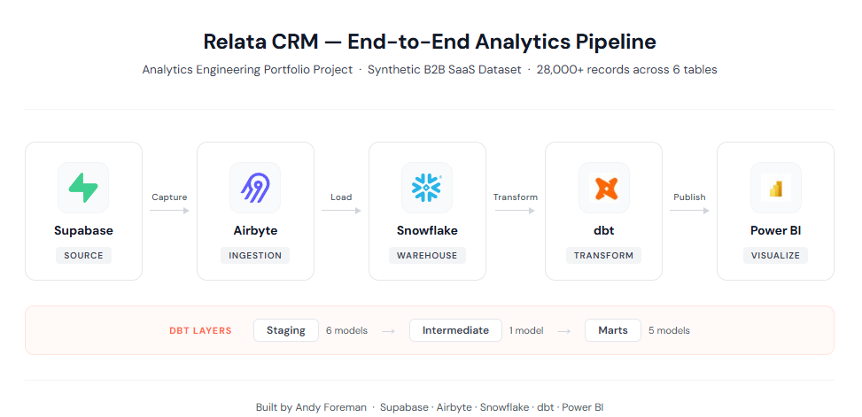
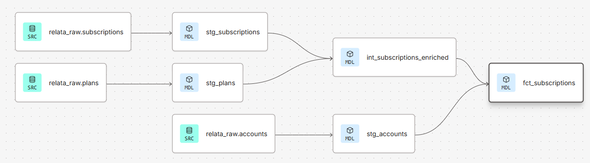
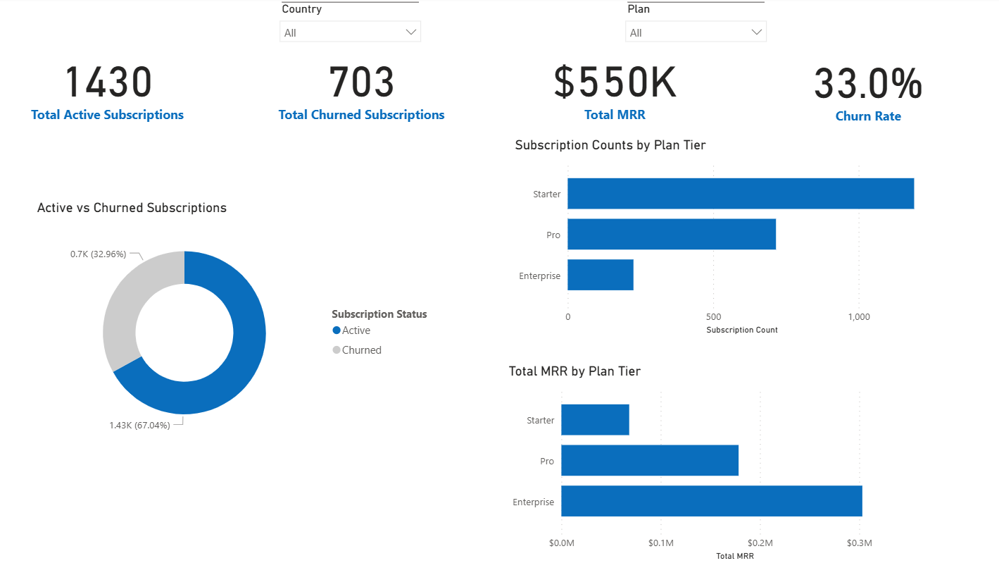

# Relata CRM: End-to-End Analytics Engineering Project
 
An end-to-end analytics engineering portfolio project built on a synthetic B2B SaaS dataset. Demonstrates a modern data stack from source ingestion through transformation to business intelligence reporting.
 

 
---
 
## Stack
 
| Layer | Tool |
|---|---|
| Source | Supabase (PostgreSQL) |
| Ingestion | Airbyte |
| Warehouse | Snowflake |
| Transformation | dbt |
| Visualization | Power BI |
 
---

## Business Questions
 
Relata CRM is a fictional B2B SaaS company selling subscription-based software to business accounts. Like any SaaS business, its financial health depends on understanding subscription growth, revenue trends, and customer retention.
 
This project was designed to answer the following business questions:
 
**Revenue**
- What is our Monthly Recurring Revenue (MRR)? MRR is the predictable, normalised revenue a SaaS company expects to receive each month from active subscriptions. MRR is the core financial metric of any subscription business.
- How is MRR trending over time, and what is our Annual Run Rate (ARR)?
- Which plan tier - Starter, Pro, or Enterprise - drives the most revenue?
  
**Subscriptions**
- How many active subscriptions do we have, and how has that grown over time?
- What is our churn rate (the percentage of subscriptions that have cancelled)?
- How are subscriptions distributed across plan tiers?
  
**Customers**
- Which industries and countries are our largest markets?
- What is the average age of an active subscription?
- How does seat utilization vary across plan tiers?
These questions shaped every modeling decision in the project, from which intermediate models to build, to which metrics to pre-calculate in the mart layer, to which visuals to include in the Power BI report.
 
## Dataset
 
Synthetic B2B SaaS CRM data generated with Python, simulating a fictional company called Relata CRM. The dataset covers a multi-year period and includes:
 
| Table | Rows | Description |
|---|---|---|
| accounts | 2,000 | Company accounts |
| users | 6,053 | Users linked to accounts |
| subscriptions | 2,133 | Subscription records |
| subscription_events | 5,546 | Lifecycle events (new, upgrade, churn, etc.) |
| invoices | 28,018 | Invoice records |
| plans | 3 | Starter, Pro, Enterprise plan tiers |
 
---
 
## Data Pipeline
 
### Ingestion
Raw data are stored in a Supabase PostgreSQL database and ingested into Snowflake using Airbyte's PostgreSQL connector. Data land in the `RELATA_RAW` database as permanent tables.
 
### Transformation
Transformations are performed by building SQL models in dbt Cloud, structured across three layers:
 
**Staging**: one model per source table, light cleaning and type casting, no business logic
- `stg_accounts`
- `stg_plans`
- `stg_users`
- `stg_subscriptions`
- `stg_subscription_events`
- `stg_invoices`
  
**Intermediate**: business logic layer, enriching and combining staging models
- `int_subscriptions_enriched` — joins subscriptions to plans, calculates MRR
  
**Marts**: analytics-ready tables consumed by Power BI
- `dim_date` — date dimension generated via `dbt_utils.date_spine`
- `dim_accounts` — account attributes for slicing and filtering
- `dim_plans` — plan attributes including sort order for BI tools
- `fct_subscriptions` — one row per subscription with status flags and derived metrics
- `fct_mrr` — monthly MRR aggregated from active subscriptions via range join

*Partial DAG showing the lineage for `fct_subscriptions`. Full project: 6 staging models → 
1 intermediate model → 5 mart models.*



### Data Quality
dbt tests are applied across all staging and mart models, covering:
- Primary key uniqueness and non-null constraints
- Foreign key relationship integrity
- Accepted values for categorical fields (status, event_type, role, billing_interval)
---
 
## dbt Project Structure
 
```
models/
├── staging/
│   ├── sources.yml
│   ├── _staging.yml
│   ├── stg_accounts.sql
│   ├── stg_plans.sql
│   ├── stg_users.sql
│   ├── stg_subscriptions.sql
│   ├── stg_subscription_events.sql
│   └── stg_invoices.sql
├── intermediate/
│   └── int_subscriptions_enriched.sql
└── marts/
    ├── dim_date.sql
    ├── dim_accounts.sql
    ├── dim_plans.sql
    ├── fct_subscriptions.sql
    └── fct_mrr.sql
```
 
---
 
## Power BI Report
 
An interactive Power BI report built on the mart layer, featuring:
- KPI cards: active subscriptions, churned subscriptions, total MRR, churn rate
- Active vs churned subscription breakdown (donut chart)
- Subscription count by plan tier (bar chart)
- MRR by plan tier (bar chart)
- Slicers for country and plan filtering with cross-report filtering

Note: This Subscription Overview dashboard is just one example of a focused visual analysis. Analysts and data scientists can perform additional analyses in Power BI (or another BI tool), as well as predictive analytics, to answer additional business questions (see Business Questions section above).


---
 
## Key Design Decisions
 
**Transient tables in dev**: dbt's Snowflake adapter defaults to transient tables for all models, avoiding Fail-safe storage costs for fully reproducible transformation layers.
 
**Calculated MRR**: MRR is derived from plan pricing (`base_price + seat_count × price_per_seat`) rather than trusting the source `monthly_amount` field directly, providing a defensible figure for downstream reporting.
 
**Range join for monthly MRR**: `fct_mrr` uses a date spine cross-joined to subscriptions, filtering on overlapping date ranges to determine which subscriptions were active in each calendar month.
 
**Plan sort order**: `dim_plans` includes a `plan_tier_order` column (Starter=1, Pro=2, Enterprise=3) to enable correct ordering in Power BI without relying on alphabetical sorting.
 
---
 
## Running the Project
 
### Prerequisites
- dbt Cloud account
- Snowflake account
- Airbyte account
- Supabase account
### Setup
1. Clone this repository
2. Configure your `profiles.yml` with Snowflake credentials (not committed)
3. Run `dbt deps` to install packages
4. Run `dbt run` to build all models
5. Run `dbt test` to validate data quality
---
 
## Author
**Andy Foreman**  
[LinkedIn](https://linkedin.com/in/anforeman)
